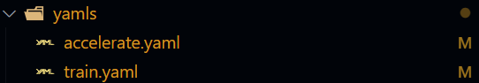

# Trainer

# Requirements

```python
pip install accelerate==0.30.0
pip install omegaconf
pip install wandb
pip install tqdm
```

# Usage

You and use `trainer_template.py` as template and define your own train loop. This template support Muti-GPU training.

To use the template, you only need `trainer_template.py` ,`trainer_utils.py` and `yamls` , and then create your own trainer

## Define a New Trainer

```python
from trainer_template import Trainer
from accelerate import Accelerator
from typing import Dict, Any
from torch.utils.data import DataLoader
from model import ToyModel
from dataset import ToyDataset
from torch import optim
from trainer_utils import get_args, load_config
import torch

class CustomTrainer(Trainer):

    def __init__(self,
                 model,
                 train_dataloader,
                 valid_dataloader,
                 criterion,
                 optimizer,
                 scheduler,
                 accelerator,
                 training_config,
                 saveing_config,
                 callbacks={}):
        super().__init__(model,
                         train_dataloader,
                         valid_dataloader,
                         criterion,
                         optimizer,
                         scheduler,
                         accelerator,
                         training_config,
                         saveing_config,
                         callbacks)

    #redefine the fit method
    def after_fit(self, *args: Any, **kwargs: Dict[str, Any]):
        self.accelerator.end_training()
        self.accelerator.wait_for_everyone()
        unwrapped_model = self.accelerator.unwrap_model(self.model)
        self.accelerator.save_model(unwrapped_model,
                                    self.saveing_config['model_save_path'])

def main():
    args = get_args()
    config = load_config(args.file)

    # Extract the configuration
    experiment_config = config['experiment_settings']
    training_config = config['training_settings']
    saving_config = config['save_settings']

    # Initialize everything
    accelerator = Accelerator(log_with=experiment_config["log"])
    accelerator.init_trackers(project_name=experiment_config['project'],
                              config=dict(training_config))
    train_dataset = ToyDataset(length=1000)
    valid_dataset = ToyDataset(length=100)
    train_data_loader = DataLoader(dataset=train_dataset,
                                   shuffle=True,
                                   batch_size=training_config['batch_size'])
    valid_data_loader = DataLoader(dataset=valid_dataset,
                                   shuffle=False,
                                   batch_size=training_config['batch_size'])
    model = ToyModel()
    optimizer = optim.Adam(model.parameters(),
                           lr=training_config['learning_rate'])
    mse_func = torch.nn.MSELoss()
    scheduler = optim.lr_scheduler.StepLR(
        optimizer,
        step_size=training_config['steplr_size'],
        gamma=training_config['steplr_gamma'])

    # Initialize the trainer
    trainer = CustomTrainer(model=model,
                            train_dataloader=train_data_loader,
                            valid_dataloader=valid_data_loader,
                            criterion=mse_func,
                            optimizer=optimizer,
                            scheduler=scheduler,
                            accelerator=accelerator,
                            training_config=training_config,
                            saveing_config=saving_config)
    #train the model
    trainer.fit()

if __name__ == '__main__':
    main()
```

## Check the Configuration



### Create the `accelerate.yaml` and `train.yaml`

You will answer some questions, and then generate this configuration.

```bash
accelerate config --config_file yamls/ccelerate.yaml
```

```yaml
compute_environment: LOCAL_MACHINE
distributed_type: MULTI_GPU
downcast_bf16: 'no'
gpu_ids: 0,1
machine_rank: 0
main_training_function: main
mixed_precision: 'no'
num_machines: 1
num_processes: 2
rdzv_backend: static
same_network: true
tpu_env: []
tpu_use_cluster: false
tpu_use_sudo: false
use_cpu: false
```

And you should specify the `train.yaml`

```yaml
experiment_settings:
  log: "wandb"
  project: "test"

training_settings:
  epochs: 1000
  learning_rate: 0.001
  steplr_size: 100
  steplr_gamma: 0.96
  batch_size: 32

save_settings:
  model_save_path: "result"
  checkpoint_path: "checkpoints/epoch={}"
```

### Test

```bash
accelerate test --config_file yamls/ccelerate.yaml
```

### Launch Training

```bash
accelerate launch --config_file yamls/accelerate.yaml train.py --file yamls/train.yaml
```

## Callback

We can use callback functions in `callback.py`. You just change the initialization of the trainer, and the callback function would be called in the corresponding part in the training loop.
Please make sure the callback funcations have the same params as the API in the trainer.


In`callback.py`

```python
class SaveCheckpoint:
    '''
    every interval epochs save the model state to the path.
    '''

    def __init__(self, interval: int, path: Union[str, Path]):
        self.interval = interval
        self.path = path

    def __call__(self, model: Module, epoch: int, accelerator: Accelerator,
                 valid_stats: Dict[str, AverageMeter]):
        if epoch == 1 or epoch % self.interval == 0:
            path = self.path.format(epoch)
            os.makedirs(path, exist_ok=True)
            accelerator.save_state(path)


class SaveModel:
    '''
    Save the model to the path.
    '''

    def __init__(self, path: Union[str, Path]):
        self.path = path

    def __call__(self, model: Module, accelerator: Accelerator,
                 valid_stats: Dict[str, AverageMeter]):
        unwrapped_model = accelerator.unwrap_model(model)
        accelerator.save_model(unwrapped_model, self.path)
```

Initialize these 2 classes

```python
save_checkpoint = SaveCheckpoint(interval=2,
                                  path=saving_config['checkpoint_path'])
save_model = SaveModel(path=saving_config['model_save_path'])
```

Plug in

```python
trainer = CustomTrainer(model=model,
                            train_dataloader=train_data_loader,
                            valid_dataloader=valid_data_loader,
                            criterion=mse_func,
                            optimizer=optimizer,
                            scheduler=scheduler,
                            accelerator=accelerator,
                            training_config=training_config,
                            saveing_config=saving_config,
                            callbacks={
                                "on_checkpoint": save_checkpoint,
                                'after_fit': save_model
                            })
```